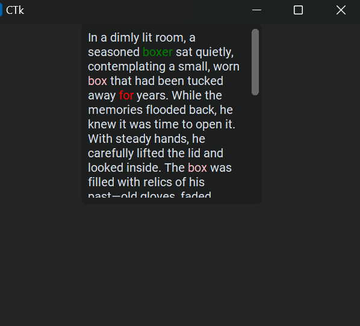

# CTK_Color
## Introduction
the library that will be used with CustomTkinter for coloring text in textbox .

## syntax
<code>CTK_Color(text_box name,text,tag,Color to be applied)</code>

## use case
this code contains <code>demo.py</code> file in which the code 

<pre styles="coding">
import CTK_Color
import customtkinter as ctk

win=ctk.CTk()

text=ctk.CTkTextbox(win)
text.pack()

CTK_Color(text,"for","bal","red").auto()
CTK_Color(text,"print","edit","orange").auto()
CTK_Color(text,"while","gang","blue").auto()
CTK_Color(text,"boxer","baler","green").auto()
win.mainloop()

</pre>

## output 

